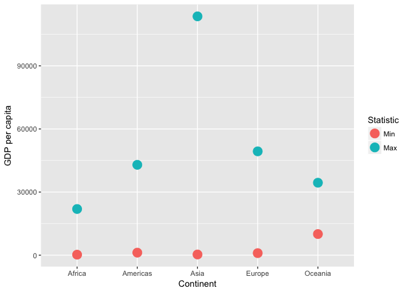
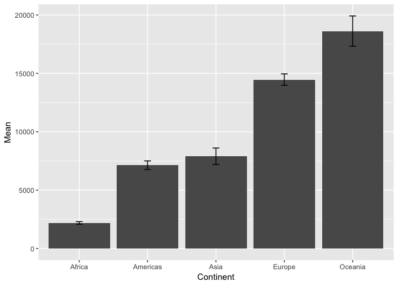
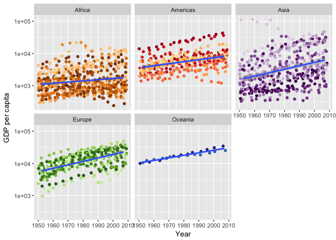
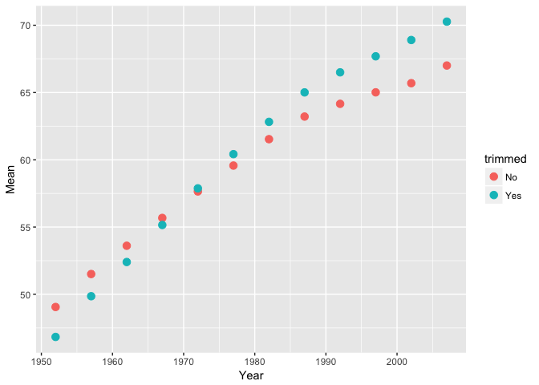
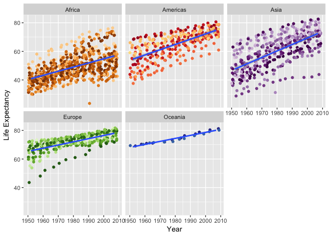
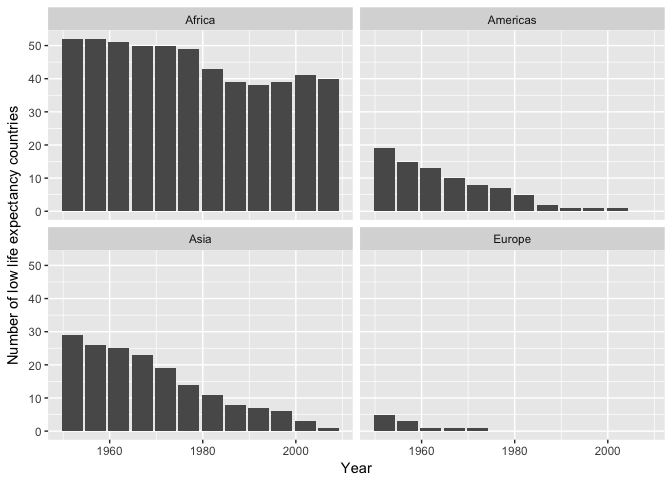
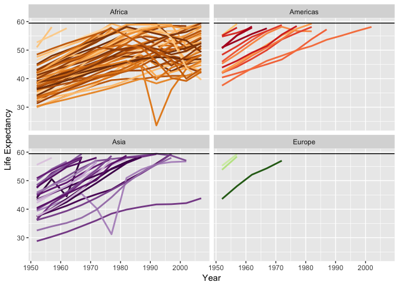
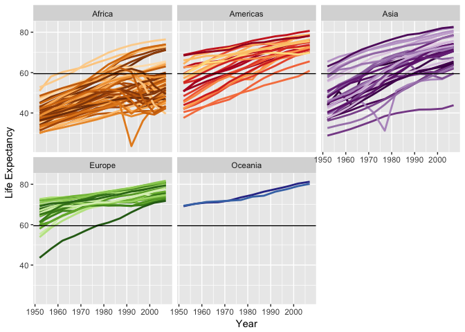
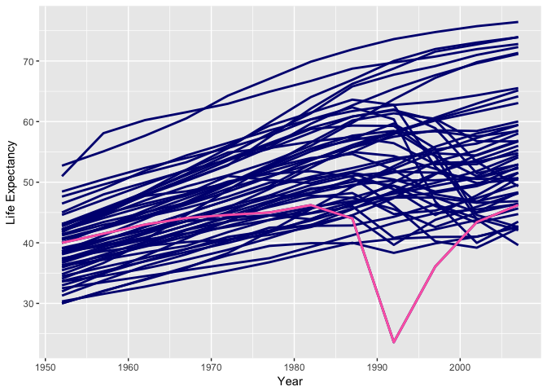

STAT545 Homework 3
================
Frederike Basedow
2 October 2018

``` r
library(tidyverse)
library(gapminder)
library(knitr)
library(reshape2)
```

### 1. Get the maximum and minimum of GDP per capita for all continents.

``` r
range(gapminder$gdpPercap)
```

    ## [1]    241.1659 113523.1329

``` r
# calculate lowest and highest gdp per capita per continent
minmax_gdp_cont <- gapminder %>% 
  group_by(continent) %>% 
  summarize(Min = min(gdpPercap), Max = max(gdpPercap))

kable(minmax_gdp_cont)
```

| continent |         Min|        Max|
|:----------|-----------:|----------:|
| Africa    |    241.1659|   21951.21|
| Americas  |   1201.6372|   42951.65|
| Asia      |    331.0000|  113523.13|
| Europe    |    973.5332|   49357.19|
| Oceania   |  10039.5956|   34435.37|

``` r
# Plot of the highest and lowest value in GDP per Capita per continent
minmax_gdp_cont %>% 
  melt(variable.name="Statistic") %>% # make data tidy for plotting
  ggplot(aes(continent, value, colour=Statistic)) + 
  geom_point(size=5) +
  labs(x="Continent", y="GDP per capita")
```



Asia has the highest value of GDP per capita of all continents throughout all years.

### 2. Look at the spread of GDP per capita within the continents.

``` r
# number of countries per continent
n_country <- gapminder %>% group_by(continent) %>% count()
kable(n_country)
```

| continent |    n|
|:----------|----:|
| Africa    |  624|
| Americas  |  300|
| Asia      |  396|
| Europe    |  360|
| Oceania   |   24|

``` r
# calculate statistics for gdpPercap and make a nice table out of it
spread_gdp_cont <- gapminder %>% 
  group_by(continent) %>% 
  summarize(Mean = mean(gdpPercap),
            Median = median(gdpPercap),
            SD = sd(gdpPercap), # standard deviation
            IQR = IQR(gdpPercap), # interquartile range
            MAD = mad(gdpPercap)) %>% # median absolute deviation
  merge(., n_country, by="continent") %>% # add number of countries as column
  mutate(SEM=SD/sqrt(n)) %>%   # calculate the standard error of the mean
  rename(Continent = continent)

kable(spread_gdp_cont)
```

| Continent |       Mean|     Median|         SD|        IQR|        MAD|    n|        SEM|
|:----------|----------:|----------:|----------:|----------:|----------:|----:|----------:|
| Africa    |   2193.755|   1192.138|   2827.930|   1616.170|   775.3226|  624|   113.2078|
| Americas  |   7136.110|   5465.510|   6396.764|   4402.431|  3269.3325|  300|   369.3173|
| Asia      |   7902.150|   2646.787|  14045.373|   7492.262|  2820.8338|  396|   705.8066|
| Europe    |  14469.476|  12081.749|   9355.213|  13248.301|  8846.0506|  360|   493.0630|
| Oceania   |  18621.609|  17983.304|   6358.983|   8072.258|  6459.1033|   24|  1298.0220|

Next, I will make a boxplot of the GDP per capita per continent to visualize the spread. Boxplots visualise the median as a line in the middle of the box, the lower and upper hinges correspond to the first and third quartiles and the length of the whiskers is 1.5x the IQR (from R documentation). Data beyond the whiskers are outliers and plotted as individual points.

``` r
# make boxplot that shows gdp per continent (log scale)
gapminder %>%  
  ggplot(aes(continent, gdpPercap)) +
  scale_y_log10() +
  geom_boxplot(outlier.color = "red") + # found out about outlier colours in Jenny Bryans repo
  labs(x="Continent", y="GDP per capita")
```


Oceania has the highest median in GDP per capita, Africa has the lowest.

We can also make a bar graph with errorbars that represent the SEM:

``` r
spread_gdp_cont %>% 
  ggplot(aes(Continent, Mean))  +
  geom_bar(stat= "identity") +
  geom_errorbar(aes(ymin=Mean-SEM, ymax=Mean+SEM), width=.1) +
  labs(x="Continent")
```



Oceania has the highest mean GDP per capita, Africa has the lowest.

To get a better overview of how the GDP data looks like for every continent, I will make a jitter graph that shows the the GDP per capita of each country over time, separated by continent.

``` r
# make plot of how change of GDP per capita over the years in each continent
gapminder %>% 
  ggplot(aes(year, gdpPercap, colour=country, group=continent)) +
  scale_y_log10()+
  geom_jitter(show.legend=FALSE) +
  geom_smooth(method=lm, show.legend=FALSE) +
  facet_wrap(~continent) +
  labs(x="Year", y="GDP per capita") +
  scale_color_manual(values = country_colors) # Found the cool country colours through Jenny Bryan's gapminder repo.
```



Looks like the GDP increased in every continent with time, although the change in Africa and the Americas seems minimal.

### 3. Compute a trimmed mean of life expectancy for different years. Or a weighted mean, weighting by population. Just try something other than the plain vanilla mean.

``` r
# calculate "vanilla" mean of life Exp
nm_lE <- mean(gapminder$lifeExp)
nm_lE
```

    ## [1] 59.47444

``` r
# calculate weighted mean for life Exp, weighing by population
wm_lE_pop <- weighted.mean(gapminder$lifeExp, gapminder$pop)
wm_lE_pop
```

    ## [1] 62.48168

``` r
# group gapminder by years for future use
gr_yrs <- gapminder %>% 
  group_by(year) 

# calculate normal and trimmed (30%) mean of lifeExp per year
means_lE <- gr_yrs %>% 
  summarize(Mean=mean(lifeExp), trMean=mean(lifeExp, trim=0.30)) %>% 
  rename(Year=year)

kable(head(means_lE))
```

|  Year|      Mean|    trMean|
|-----:|---------:|---------:|
|  1952|  49.05762|  46.83114|
|  1957|  51.50740|  49.85769|
|  1962|  53.60925|  52.40092|
|  1967|  55.67829|  55.15267|
|  1972|  57.64739|  57.87755|
|  1977|  59.57016|  60.41925|

``` r
# make into tidy data for plotting

tidy_means_lE <- means_lE %>% 
  gather(key="trimmed", value="Mean", Mean, trMean)  %>% 
  mutate(trimmed = recode(trimmed, trMean="Yes", Mean="No"))

kable(head(tidy_means_lE))
```

|  Year| trimmed |      Mean|
|-----:|:--------|---------:|
|  1952| No      |  49.05762|
|  1957| No      |  51.50740|
|  1962| No      |  53.60925|
|  1967| No      |  55.67829|
|  1972| No      |  57.64739|
|  1977| No      |  59.57016|

``` r
# plot both normal and trimmed means
tidy_means_lE %>% 
  ggplot(aes(Year, Mean, colour=trimmed)) +
  geom_point(size=3) +
  labs(x="Year", y="Mean")
```



The trimmed mean (Yes) is lower in in early years and higher in later years than the normal mean (No).

### 4. How is life expectancy changing over time on different continents?

``` r
# show change of life expectancy over time for countries in each continent
gapminder %>% 
  ggplot(aes(year, lifeExp, colour=country, group=continent)) +
  geom_jitter(show.legend=FALSE) +
  geom_smooth(method=lm, show.legend=FALSE) +
  facet_wrap(~continent) +
  labs(x="Year", y="Life Expectancy") +
  scale_color_manual(values = country_colors)
```



Life expectancy is increasing over time in all continents.

### 5. Report the absolute and/or relative abundance of countries with low life expectancy over time by continent: Compute some measure of worldwide life expectancy – you decide – a mean or median or some other quantile or perhaps your current age. Then determine how many countries on each continent have a life expectancy less than this benchmark, for each year.

I will use the mean of life expectancy over all countries and all years as a measure of worldwide life expectancy.

``` r
# get mean life expectancy per year of countries with mean lifeExp lower than normal mean 
low_lE <- gapminder %>% 
  group_by(year, country, continent) %>% 
  summarize(mean = mean(lifeExp)) %>% 
  filter(mean < nm_lE) %>% 
  group_by(continent, year) %>% 
  summarize(n = n()) %>% 
  select(year, continent, n)

kable(head(low_lE))
```

|  year| continent |    n|
|-----:|:----------|----:|
|  1952| Africa    |   52|
|  1957| Africa    |   52|
|  1962| Africa    |   51|
|  1967| Africa    |   50|
|  1972| Africa    |   50|
|  1977| Africa    |   49|

``` r
# other way to do this
llE <- gr_yrs %>% filter(lifeExp < nm_lE) # gr_yrs is previously grouped gapminder by year

low_lE_2 <- llE %>% 
  group_by(year, continent) %>% 
  count() %>% 
  arrange(continent)

kable(head(low_lE_2))
```

|  year| continent |    n|
|-----:|:----------|----:|
|  1952| Africa    |   52|
|  1957| Africa    |   52|
|  1962| Africa    |   51|
|  1967| Africa    |   50|
|  1972| Africa    |   50|
|  1977| Africa    |   49|

``` r
# plot number of countries with low life expectancies over the years 
low_lE %>% 
  ggplot(aes(year, n, group=continent)) + 
  geom_bar(stat="identity") +
  facet_wrap(~continent) +
  labs(y="Number of low life expectancy countries", x="Year")
```



This graph shows the number of countries with low life expectancy per continent over the years. Afrika has the highest number of low life expectancy countries and only a relatively small decline in numbers over the years.

Let's look at the total number of low life expectancy countries per continent (not differentiated by year)

``` r
# how many countries have a life expectancy less than nm_lE in general, not per year
summary(llE$continent) 
```

    ##   Africa Americas     Asia   Europe  Oceania 
    ##      544       82      172       11        0

``` r
# same result, different way
n_llE_country <- llE %>% 
  group_by(continent) %>% 
  count()

kable(n_llE_country)
```

| continent |    n|
|:----------|----:|
| Africa    |  544|
| Americas  |   82|
| Asia      |  172|
| Europe    |   11|

``` r
# compare number of low life expectancy countries with total number of countries per continent and calculate percentages
comp_countries <- 
  merge(n_llE_country, n_country, by="continent") %>% # Oceania get's excluded here, probably because it has zero observations. Not sure how to avoid that.
  mutate(perc_llE = paste0(round(n.x/n.y*100, 2), "%")) %>%  
  rename("No. all countries" = n.y, "No. low life Exp countries" = n.x, "% low life Exp countries" = perc_llE) 

kable(comp_countries)
```

| continent |  No. low life Exp countries|  No. all countries| % low life Exp countries |
|:----------|---------------------------:|------------------:|:-------------------------|
| Africa    |                         544|                624| 87.18%                   |
| Americas  |                          82|                300| 27.33%                   |
| Asia      |                         172|                396| 43.43%                   |
| Europe    |                          11|                360| 3.06%                    |

Afrika has the highest percentage of low life expectancy countries.

Next, I will make two graphs that show the life expectancy of each country per continent over the years. One will show only the low life expectancy countries, the other one will show all countries. I will add a line to show the worldwide life expectancy (mean life expectancy of all continents).

``` r
llE %>% 
  ggplot(aes(year, lifeExp, group=country, colour=country)) +
  geom_line(lwd=1, show.legend=FALSE) +
  geom_hline(yintercept = nm_lE) +
  facet_wrap(~continent) +
  scale_color_manual(values = country_colors) +
  labs(x="Year", y="Life Expectancy")
```



This plot shows the life expectancy over time of the countries with low life expectancy in each continent. The black line indicates the mean worldwide life expectancy. You can see that each country has a lower life expectancy in every year than this mean. Africa has the most countries that fall below the worldwide life expectancy.

Let's compare this to the data of all countries:

``` r
gapminder %>% 
  ggplot(aes(year, lifeExp, group=country, colour=country)) +
  geom_line(lwd=1, show.legend=FALSE) +
  geom_hline(yintercept = nm_lE) +
  facet_wrap(~continent) +
  scale_color_manual(values = country_colors) +
  labs(x="Year", y="Life Expectancy")
```



In this graph you can see that most of Africa's countries fall below the mean life expectancy, while most countries in Europe and all countries in Oceania fall above it.

### 6. Find countries with interesting stories. Open-ended and, therefore, hard. Promising but unsuccessful attempts are encouraged. This will generate interesting questions to follow up on in class.

It looks like there is a country in Africa that had a big drop in life expectancy between 1987 and 1992. Let's figure out which country that is.

``` r
drop_lE <- gapminder %>% 
  group_by(country) %>% 
  mutate(drop = (lifeExp - lifeExp[year == 1987])) %>% 
  filter(continent == "Africa", year == 1992) %>% 
  summarize(Max = max(drop)) %>% 
  arrange(Max) 

kable(head(drop_lE))
```

| country |      Max|
|:--------|--------:|
| Rwanda  |  -20.421|
| Liberia |   -5.225|
| Somalia |   -4.843|
| Zambia  |   -4.721|
| Burundi |   -3.475|
| Uganda  |   -2.684|

Rwanda is the country with the biggest drop in the early 1990's. Let's check if this is true by highlighting Rwanda in a plot of Africa's life expectancies.

``` r
Rwanda <- gapminder %>% filter(country == "Rwanda")

gapminder %>% 
  filter(continent== "Africa") %>% 
  ggplot(aes(year, lifeExp, group=country)) +
  geom_line(lwd=1, colour = "navy") +
  geom_line(data = Rwanda, aes(year, lifeExp), lwd=1, colour = "hotpink") +
  labs(x="Year", y="Life Expectancy")
```



Rwanda is indeed the country with the drop in life expectancy in 1992.
