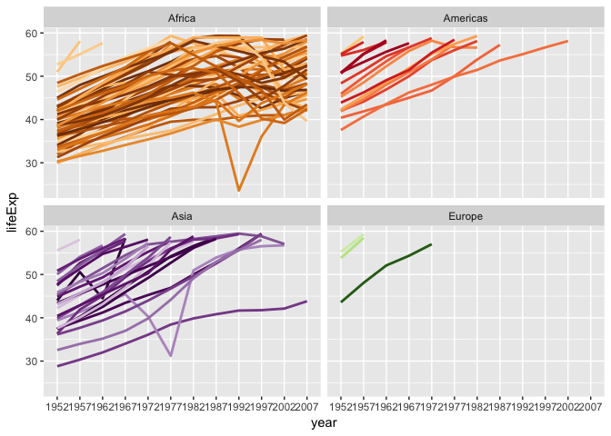

STAT545 Homework 3
================
Frederike Basedow
26 September 2018

``` r
library(tidyverse)
library(gapminder)
library(knitr)
library(reshape2)
```

### 1. Get the maximum and minimum of GDP per capita for all continents.

``` r
range(gapminder$gdpPercap)
```

    ## [1]    241.1659 113523.1329

``` r
gapminder %>% 
  ggplot(aes(year, lifeExp, colour=country, group=continent)) +
  geom_jitter(show.legend=FALSE) +
  geom_smooth(method=lm, show.legend=FALSE) +
  facet_wrap(~continent) +
  labs(x="Year", y="Life Expectancy") +
  scale_color_manual(values = country_colors)
```

 Looks like the gdp increased in every continent with time, although the change in Afrika and the Americas in minimal.

Found the cool country colours through Jenny Brian's gapminder repo

### 2. Look at the spread of GDP per capita within the continents.

``` r
# group gapminder by continent
gr_cont <- gapminder %>% group_by(continent)

# calculate lowest, highest and mean value of gdp per continent
mean_gdp_cont <- gr_cont %>% summarize(Mean=mean(gdpPercap))
min_gdp_cont <- gr_cont %>% summarize(Min=min(gdpPercap))
max_gdp_cont <- gr_cont %>% summarize(Max=max(gdpPercap))

# merge results together into one data frame
mm_gdp_cont <- merge(mean_gdp_cont, min_gdp_cont, by="continent")
sum_gdp_cont <- merge(mm_gdp_cont, max_gdp_cont, by="continent") %>% 
  rename(Continent=continent)

# show results in nice table
kable(sum_gdp_cont)
```

| Continent |       Mean|         Min|        Max|
|:----------|----------:|-----------:|----------:|
| Africa    |   2193.755|    241.1659|   21951.21|
| Americas  |   7136.110|   1201.6372|   42951.65|
| Asia      |   7902.150|    331.0000|  113523.13|
| Europe    |  14469.476|    973.5332|   49357.19|
| Oceania   |  18621.609|  10039.5956|   34435.37|

``` r
# make boxplot that shows gdp stats per country on a log scale
gapminder %>%  
  ggplot(aes(continent, gdpPercap)) +
  scale_y_log10() +
  geom_boxplot(outlier.color = "red") +
  labs(x="Continent", y="GDP per capita")
```


Problem: cannot pipe gapminder into base R funtions `summary()` or `range`. This makes it hard to use these function for previously sorted data. Feel like my solution is very long and I am wondering if there is a shorter way to do this. Found summarize function in "data wrangling with tidyverse and dplyr" cheatsheet

### 3. Compute a trimmed mean of life expectancy for different years. Or a weighted mean, weighting by population. Just try something other than the plain vanilla mean.

``` r
# calculate "vanilla" mean of life Exp
nm_lE <- mean(gapminder$lifeExp)
nm_lE
```

    ## [1] 59.47444

``` r
# calculate weighted mean for life Exp, weighing by population
wm_lE_pop <- weighted.mean(gapminder$lifeExp, gapminder$pop)
wm_lE_pop
```

    ## [1] 62.48168

``` r
# group gapminder data by year
gr_yrs <- gapminder %>% 
  group_by(year)

# calculate normal mean of life Exp per year
nm_lEy <- gr_yrs %>% 
  summarize(Mean=mean(lifeExp)) %>% 
  rename(Year=year)
kable(nm_lEy)
```

|  Year|      Mean|
|-----:|---------:|
|  1952|  49.05762|
|  1957|  51.50740|
|  1962|  53.60925|
|  1967|  55.67829|
|  1972|  57.64739|
|  1977|  59.57016|
|  1982|  61.53320|
|  1987|  63.21261|
|  1992|  64.16034|
|  1997|  65.01468|
|  2002|  65.69492|
|  2007|  67.00742|

``` r
# calculate trimmed mean, by 30%, for each year
tm_lEy <- gr_yrs %>% 
  summarize(trMean=mean(lifeExp, trim=0.30)) %>% 
  rename(Year=year)
kable(tm_lEy)
```

|  Year|    trMean|
|-----:|---------:|
|  1952|  46.83114|
|  1957|  49.85769|
|  1962|  52.40092|
|  1967|  55.15267|
|  1972|  57.87755|
|  1977|  60.41925|
|  1982|  62.81936|
|  1987|  65.00983|
|  1992|  66.50200|
|  1997|  67.69257|
|  2002|  68.90531|
|  2007|  70.27053|

``` r
# make matrix that includes both normal and trimmed mean for plotting
mns_lE <- (merge(tm_lEy, nm_lEy, by="Year")) %>% # combine normal mean and trimmed mean data
  column_to_rownames(var="Year") %>% # make years the rownames
  as.matrix() %>% # change to matrix for keeping years properly after melting
  melt(value.name = "Mean") %>% # combines Mean variables to one column with values and one column with respective labels
  rename(Year=Var1) %>% # change name of year column
  rename(trimmed=Var2) %>% # change column name of column that indicates if mean has bene trimmed
  mutate(trimmed = recode(trimmed, trMean="Yes", Mean="No")) # change level names of trimmed variable
head(mns_lE)
```

    ##   Year trimmed     Mean
    ## 1 1952     Yes 46.83114
    ## 2 1957     Yes 49.85769
    ## 3 1962     Yes 52.40092
    ## 4 1967     Yes 55.15267
    ## 5 1972     Yes 57.87755
    ## 6 1977     Yes 60.41925

``` r
mns_lE %>% 
  ggplot(aes(Year, Mean, colour=trimmed)) +
  geom_point() +
  labs(x="Year", y="Mean")
```


### 4. How is life expectancy changing over time on different continents?

``` r
gapminder %>% 
  ggplot(aes(year, lifeExp, colour=continent)) +
  geom_jitter() +
  geom_smooth(method=lm) +
  labs(x="Year", y="Life Expectancy") 
```


### 5. Report the absolute and/or relative abundance of countries with low life expectancy over time by continent: Compute some measure of worldwide life expectancy – you decide – a mean or median or some other quantile or perhaps your current age. Then determine how many countries on each continent have a life expectancy less than this benchmark, for each year.

``` r
nm_lE
```

    ## [1] 59.47444

``` r
llE <- gr_yrs %>% filter(lifeExp < nm_lE) # this is not the mean, do i need the mean?

# lifeExp of country is < nm_lE for year x
# nlevels(continent) in year x for which lifeExp < nm_lE
llE$year <- as.factor(llE$year)
lvl_yrs <- levels(llE$year)

summary(llE$continent) # gives you how many countries have a life expectancy less than nm_lE in general, not per year
```

    ##   Africa Americas     Asia   Europe  Oceania 
    ##      544       82      172       11        0

``` r
lvl_cont <- levels(llE$continent)

for (i in 1:nlevels(llE$continent)){
  
  j <- llE %>% count(lvl_cont[i]) 
  
  if (i < 2){
    k <- j
    }else{
      k<- bind_rows(k,j)  
    }
}

nc_llE <- k %>% 
  rename(continent=`lvl_cont[i]`) %>% 
  rename(n_countries=n)

nc_llE  # can I add the mean lifeExp per year per continent?
```

    ## # A tibble: 60 x 3
    ## # Groups:   year [12]
    ##    year  continent n_countries
    ##    <fct> <chr>           <int>
    ##  1 1952  Africa            105
    ##  2 1957  Africa             96
    ##  3 1962  Africa             90
    ##  4 1967  Africa             84
    ##  5 1972  Africa             78
    ##  6 1977  Africa             70
    ##  7 1982  Africa             59
    ##  8 1987  Africa             49
    ##  9 1992  Africa             46
    ## 10 1997  Africa             46
    ## # ... with 50 more rows

``` r
llE %>% 
  ggplot(aes(year, lifeExp, group=country, colour=country)) +
  geom_line(lwd=1, show.legend=FALSE) +
  facet_wrap(~continent) +
  scale_color_manual(values = country_colors)
```



### 6. Find countries with interesting stories. Open-ended and, therefore, hard. Promising but unsuccessful attempts are encouraged. This will generate interesting questions to follow up on in class.

Or, make up your own! Between the dplyr coverage in class and the list above, I think you get the idea.
