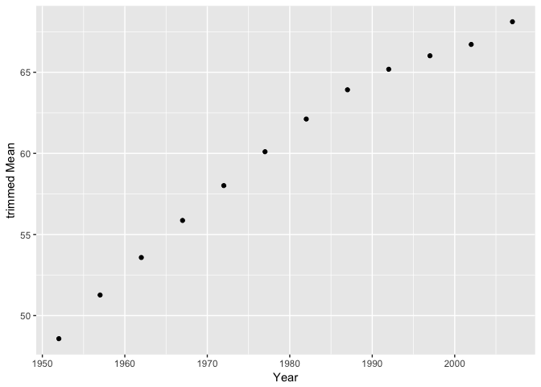

STAT545 Homework 3
================
Frederike Basedow
26 September 2018

``` r
library(tidyverse)
library(gapminder)
library(knitr)
```

### 1. Get the maximum and minimum of GDP per capita for all continents.

``` r
range(gapminder$gdpPercap)
```

    ## [1]    241.1659 113523.1329

Looks like the gdp increased in every continent with time, although the change in Afrika and the Americas in minimal.

### 2. Look at the spread of GDP per capita within the continents.

``` r
# group gapminder by continent
gr_cont <- gapminder %>% group_by(continent)

# calculate lowest, highest and mean value of gdp per continent
mean_gdp_cont <- gr_cont %>% summarize(Mean=mean(gdpPercap))
min_gdp_cont <- gr_cont %>% summarize(Min=min(gdpPercap))
max_gdp_cont <- gr_cont %>% summarize(Max=max(gdpPercap))

# merge results together into one data frame
mm_gdp_cont <- merge(mean_gdp_cont, min_gdp_cont, by="continent")
sum_gdp_cont <- merge(mm_gdp_cont, max_gdp_cont, by="continent")

# rename continent variable
sum_gdp_cont <- rename(sum_gdp_cont, Continent=continent)

# show results in nice table
kable(sum_gdp_cont)
```

| Continent |       Mean|         Min|        Max|
|:----------|----------:|-----------:|----------:|
| Africa    |   2193.755|    241.1659|   21951.21|
| Americas  |   7136.110|   1201.6372|   42951.65|
| Asia      |   7902.150|    331.0000|  113523.13|
| Europe    |  14469.476|    973.5332|   49357.19|
| Oceania   |  18621.609|  10039.5956|   34435.37|

``` r
# make boxplot that shows gdp stats per country on a log scale
gapminder %>%  
  ggplot(aes(continent, gdpPercap)) +
  scale_y_log10() +
  geom_boxplot() +
  labs(x="Continent", y="GDP per capita")
```


Problem: cannot pipe gapminder into base R funtions `summary()` or `range`. This makes it hard to use these function for previously sorted data. Feel like my solution is very long and I am wondering if there is a shorter way to do this. Found summarize function in "data wrangling with tidyverse and dplyr" cheatsheet

### 3. Compute a trimmed mean of life expectancy for different years. Or a weighted mean, weighting by population. Just try something other than the plain vanilla mean.

``` r
# calculate "vanilla" mean of life Exp
nm_lE <- mean(gapminder$lifeExp)
nm_lE
```

    ## [1] 59.47444

``` r
# calculate weighted mean for life Exp, weighing by population
wm_lE_pop <- weighted.mean(gapminder$lifeExp, gapminder$pop)
wm_lE_pop
```

    ## [1] 62.48168

``` r
# calculate trimmed mean for life Exp, trimmed by 10%, for each year
gr_yrs <- gapminder %>% group_by(year)
nm_lEy <- gr_yrs %>% summarize(Mean=mean(lifeExp))
nm_lEy <- rename(nm_lEy, Year=year)
kable(nm_lEy)
```

|  Year|      Mean|
|-----:|---------:|
|  1952|  49.05762|
|  1957|  51.50740|
|  1962|  53.60925|
|  1967|  55.67829|
|  1972|  57.64739|
|  1977|  59.57016|
|  1982|  61.53320|
|  1987|  63.21261|
|  1992|  64.16034|
|  1997|  65.01468|
|  2002|  65.69492|
|  2007|  67.00742|

``` r
tm_lE <- gr_yrs %>% summarize(trMean=mean(lifeExp, trim=0.1))
tm_lE <-rename(tm_lE, Year=year)
kable(tm_lE)
```

|  Year|    trMean|
|-----:|---------:|
|  1952|  48.57668|
|  1957|  51.26888|
|  1962|  53.58075|
|  1967|  55.86538|
|  1972|  58.01444|
|  1977|  60.10206|
|  1982|  62.11694|
|  1987|  63.92106|
|  1992|  65.18519|
|  1997|  66.01736|
|  2002|  66.71641|
|  2007|  68.11489|

``` r
mn_lE_comp <- merge(tm_lE, nm_lEy, by="Year")
mn_lE_comp
```

    ##    Year   trMean     Mean
    ## 1  1952 48.57668 49.05762
    ## 2  1957 51.26888 51.50740
    ## 3  1962 53.58075 53.60925
    ## 4  1967 55.86538 55.67829
    ## 5  1972 58.01444 57.64739
    ## 6  1977 60.10206 59.57016
    ## 7  1982 62.11694 61.53320
    ## 8  1987 63.92106 63.21261
    ## 9  1992 65.18519 64.16034
    ## 10 1997 66.01736 65.01468
    ## 11 2002 66.71641 65.69492
    ## 12 2007 68.11489 67.00742

``` r
tm_lE %>% 
  ggplot(aes(Year, trMean)) +
  geom_point() +
  labs(x="Year", y="trimmed Mean")
```



### 4. How is life expectancy changing over time on different continents?

### 5. Report the absolute and/or relative abundance of countries with low life expectancy over time by continent: Compute some measure of worldwide life expectancy – you decide – a mean or median or some other quantile or perhaps your current age. Then determine how many countries on each continent have a life expectancy less than this benchmark, for each year.

### 6. Find countries with interesting stories. Open-ended and, therefore, hard. Promising but unsuccessful attempts are encouraged. This will generate interesting questions to follow up on in class.

Or, make up your own! Between the dplyr coverage in class and the list above, I think you get the idea.
