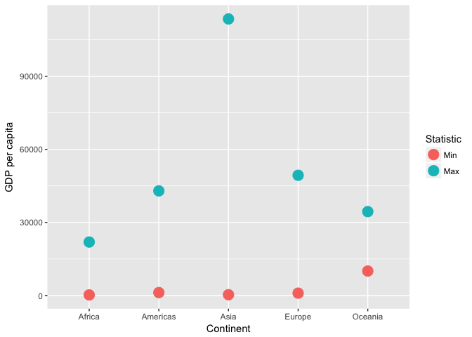
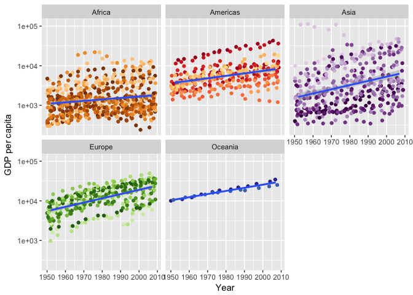

STAT545 Homework 3
================
Frederike Basedow
26 September 2018

``` r
library(tidyverse)
library(gapminder)
library(knitr)
library(reshape2)
```

### 1. Get the maximum and minimum of GDP per capita for all continents.

``` r
range(gapminder$gdpPercap)
```

    ## [1]    241.1659 113523.1329

``` r
# calculate lowest and highest gdp per capita per continent
minmax_gdp_cont <- gapminder %>% 
  group_by(continent) %>% 
  summarize(Min = min(gdpPercap), Max = max(gdpPercap))

kable(minmax_gdp_cont)
```

| continent |         Min|        Max|
|:----------|-----------:|----------:|
| Africa    |    241.1659|   21951.21|
| Americas  |   1201.6372|   42951.65|
| Asia      |    331.0000|  113523.13|
| Europe    |    973.5332|   49357.19|
| Oceania   |  10039.5956|   34435.37|

``` r
# Plot of the highest and lowest value in GDP per Capita per continent
minmax_gdp_cont %>% 
  melt(variable.name="Statistic") %>% 
  ggplot(aes(continent,value, colour=Statistic)) + 
  geom_point() +
  labs(x="Continent", y="GDP per capita")
```

    ## Using continent as id variables



``` r
# make boxplot that shows gdp stats per continent on a log scale
gapminder %>%  
  ggplot(aes(continent, gdpPercap)) +
  scale_y_log10() +
  geom_boxplot(outlier.color = "red") +
  labs(x="Continent", y="GDP per capita")
```


``` r
gapminder %>% 
  ggplot(aes(year, gdpPercap, colour=country, group=continent)) +
  scale_y_log10()+
  geom_jitter(show.legend=FALSE) +
  geom_smooth(method=lm, show.legend=FALSE) +
  facet_wrap(~continent) +
  labs(x="Year", y="GDP per capita") +
  scale_color_manual(values = country_colors)
```



Looks like the gdp increased in every continent with time, although the change in Afrika and the Americas in minimal.

Found the cool country colours through Jenny Brian's gapminder repo

### 2. Look at the spread of GDP per capita within the continents.

Problem: cannot pipe gapminder into base R funtions `summary()` or `range`. This makes it hard to use these function for previously sorted data. Feel like my solution is very long and I am wondering if there is a shorter way to do this. Found summarize function in "data wrangling with tidyverse and dplyr" cheatsheet

### 3. Compute a trimmed mean of life expectancy for different years. Or a weighted mean, weighting by population. Just try something other than the plain vanilla mean.

``` r
# calculate "vanilla" mean of life Exp
nm_lE <- mean(gapminder$lifeExp)
nm_lE
```

    ## [1] 59.47444

``` r
# calculate weighted mean for life Exp, weighing by population
wm_lE_pop <- weighted.mean(gapminder$lifeExp, gapminder$pop)
wm_lE_pop
```

    ## [1] 62.48168

``` r
# group gapminder data by year
gr_yrs <- gapminder %>% 
  group_by(year)

# calculate normal mean of life Exp per year
nm_lEy <- gr_yrs %>% 
  summarize(Mean=mean(lifeExp)) %>% 
  rename(Year=year)
kable(nm_lEy)
```

|  Year|      Mean|
|-----:|---------:|
|  1952|  49.05762|
|  1957|  51.50740|
|  1962|  53.60925|
|  1967|  55.67829|
|  1972|  57.64739|
|  1977|  59.57016|
|  1982|  61.53320|
|  1987|  63.21261|
|  1992|  64.16034|
|  1997|  65.01468|
|  2002|  65.69492|
|  2007|  67.00742|

``` r
# calculate trimmed mean, by 30%, for each year
tm_lEy <- gr_yrs %>% 
  summarize(trMean=mean(lifeExp, trim=0.30)) %>% 
  rename(Year=year)
kable(tm_lEy)
```

|  Year|    trMean|
|-----:|---------:|
|  1952|  46.83114|
|  1957|  49.85769|
|  1962|  52.40092|
|  1967|  55.15267|
|  1972|  57.87755|
|  1977|  60.41925|
|  1982|  62.81936|
|  1987|  65.00983|
|  1992|  66.50200|
|  1997|  67.69257|
|  2002|  68.90531|
|  2007|  70.27053|

``` r
# make matrix that includes both normal and trimmed mean for plotting
mns_lE <- (merge(tm_lEy, nm_lEy, by="Year")) %>% # combine normal mean and trimmed mean data
  column_to_rownames(var="Year") %>% # make years the rownames
  as.matrix() %>% # change to matrix for keeping years properly after melting
  melt(value.name = "Mean") %>% # combines Mean variables to one column with values and one column with respective labels
  rename(Year=Var1) %>% # change name of year column
  rename(trimmed=Var2) %>% # change column name of column that indicates if mean has bene trimmed
  mutate(trimmed = recode(trimmed, trMean="Yes", Mean="No")) # change level names of trimmed variable
head(mns_lE)
```

    ##   Year trimmed     Mean
    ## 1 1952     Yes 46.83114
    ## 2 1957     Yes 49.85769
    ## 3 1962     Yes 52.40092
    ## 4 1967     Yes 55.15267
    ## 5 1972     Yes 57.87755
    ## 6 1977     Yes 60.41925

``` r
mns_lE %>% 
  ggplot(aes(Year, Mean, colour=trimmed)) +
  geom_point() +
  labs(x="Year", y="Mean")
```


### 4. How is life expectancy changing over time on different continents?

``` r
gapminder %>% 
  ggplot(aes(year, lifeExp, colour=continent)) +
  geom_jitter() +
  geom_smooth(method=lm) +
  labs(x="Year", y="Life Expectancy") 
```


``` r
# show change of life expectancy over time for countries in each continent
gapminder %>% 
  ggplot(aes(year, lifeExp, colour=country, group=continent)) +
  geom_jitter(show.legend=FALSE) +
  geom_smooth(method=lm, show.legend=FALSE) +
  facet_wrap(~continent) +
  labs(x="Year", y="Life Expectancy") +
  scale_color_manual(values = country_colors)
```


### 5. Report the absolute and/or relative abundance of countries with low life expectancy over time by continent: Compute some measure of worldwide life expectancy – you decide – a mean or median or some other quantile or perhaps your current age. Then determine how many countries on each continent have a life expectancy less than this benchmark, for each year.

``` r
# get mean life expectancy per year of countries with mean lifeExp lower than normal mean 
low_lE <- gapminder %>% 
  group_by(year, country, continent) %>% 
  summarize(mean=mean(lifeExp)) %>% 
  filter(mean < nm_lE) %>% 
  group_by(continent, year) %>% 
  summarize(num=n()) %>% 
  select(year, continent, num)

# other way
llE <- gr_yrs %>% filter(lifeExp < nm_lE) # this is not the mean, do i need the mean?
n_CbyY <-llE %>% 
  group_by(year, continent) %>% 
  count() %>% 
  arrange(continent)

low_lE == n_CbyY
```

    ##       year continent  num
    ##  [1,] TRUE      TRUE TRUE
    ##  [2,] TRUE      TRUE TRUE
    ##  [3,] TRUE      TRUE TRUE
    ##  [4,] TRUE      TRUE TRUE
    ##  [5,] TRUE      TRUE TRUE
    ##  [6,] TRUE      TRUE TRUE
    ##  [7,] TRUE      TRUE TRUE
    ##  [8,] TRUE      TRUE TRUE
    ##  [9,] TRUE      TRUE TRUE
    ## [10,] TRUE      TRUE TRUE
    ## [11,] TRUE      TRUE TRUE
    ## [12,] TRUE      TRUE TRUE
    ## [13,] TRUE      TRUE TRUE
    ## [14,] TRUE      TRUE TRUE
    ## [15,] TRUE      TRUE TRUE
    ## [16,] TRUE      TRUE TRUE
    ## [17,] TRUE      TRUE TRUE
    ## [18,] TRUE      TRUE TRUE
    ## [19,] TRUE      TRUE TRUE
    ## [20,] TRUE      TRUE TRUE
    ## [21,] TRUE      TRUE TRUE
    ## [22,] TRUE      TRUE TRUE
    ## [23,] TRUE      TRUE TRUE
    ## [24,] TRUE      TRUE TRUE
    ## [25,] TRUE      TRUE TRUE
    ## [26,] TRUE      TRUE TRUE
    ## [27,] TRUE      TRUE TRUE
    ## [28,] TRUE      TRUE TRUE
    ## [29,] TRUE      TRUE TRUE
    ## [30,] TRUE      TRUE TRUE
    ## [31,] TRUE      TRUE TRUE
    ## [32,] TRUE      TRUE TRUE
    ## [33,] TRUE      TRUE TRUE
    ## [34,] TRUE      TRUE TRUE
    ## [35,] TRUE      TRUE TRUE
    ## [36,] TRUE      TRUE TRUE
    ## [37,] TRUE      TRUE TRUE
    ## [38,] TRUE      TRUE TRUE
    ## [39,] TRUE      TRUE TRUE
    ## [40,] TRUE      TRUE TRUE

``` r
# how many countries have a life expectancy less than nm_lE in general, not per year
summary(llE$continent) 
```

    ##   Africa Americas     Asia   Europe  Oceania 
    ##      544       82      172       11        0

``` r
# same output, different way
llE %>% 
  group_by(continent) %>% 
  count()
```

    ## # A tibble: 4 x 2
    ## # Groups:   continent [4]
    ##   continent     n
    ##   <fct>     <int>
    ## 1 Africa      544
    ## 2 Americas     82
    ## 3 Asia        172
    ## 4 Europe       11

``` r
# lifeExp of country is < nm_lE for year x
# nlevels(continent) in year x for which lifeExp < nm_lE

# try loop option, something's wrong
lvl_cont <- levels(llE$continent)

for (i in 1:nlevels(llE$continent)){
  
  j <- llE %>%  
    count(lvl_cont[i]) 
  
  if (i < 2){
    k <- j
    }else{
      k<- bind_rows(k,j)  
    }
}

nc_llE <- k %>% 
  rename(continent=`lvl_cont[i]`) %>% 
  rename(n_countries=n)
# see lecture 8 to make this easier
nc_llE  # can I add the mean lifeExp per year per continent?
```

    ## # A tibble: 60 x 3
    ## # Groups:   year [12]
    ##     year continent n_countries
    ##    <int> <chr>           <int>
    ##  1  1952 Africa            105
    ##  2  1957 Africa             96
    ##  3  1962 Africa             90
    ##  4  1967 Africa             84
    ##  5  1972 Africa             78
    ##  6  1977 Africa             70
    ##  7  1982 Africa             59
    ##  8  1987 Africa             49
    ##  9  1992 Africa             46
    ## 10  1997 Africa             46
    ## # ... with 50 more rows

``` r
llE %>% 
  ggplot(aes(year, lifeExp, group=country, colour=country)) +
  geom_line(lwd=1, show.legend=FALSE) +
  geom_hline(yintercept = nm_lE) +
  facet_wrap(~continent) +
  scale_color_manual(values = country_colors) +
  labs(x="Year", y="Life Expectancy")
```


``` r
gapminder %>% 
  ggplot(aes(year, lifeExp, group=country, colour=country)) +
  geom_line(lwd=1, show.legend=FALSE) +
  geom_hline(yintercept = nm_lE) +
  facet_wrap(~continent) +
  scale_color_manual(values = country_colors) +
  labs(x="Year", y="Life Expectancy")
```


These plots shows the life expectancy over the years in different continents. Each line represents a country in the continent. The black line is the average life expectancy of all countries in all years.

### 6. Find countries with interesting stories. Open-ended and, therefore, hard. Promising but unsuccessful attempts are encouraged. This will generate interesting questions to follow up on in class.

It looks like there is a country in Afrika that had a big drop in life expectancy between 1987 and 1992. Let's figure out which country that is.

``` r
gapminder %>% 
  group_by(country) %>% 
  mutate(drop = (lifeExp - lifeExp[year == 1987])) %>% 
  filter(continent == "Africa", year == 1992) %>% 
  summarize(Max = max(drop)) %>% 
  arrange(Max) 
```

    ## # A tibble: 52 x 2
    ##    country             Max
    ##    <fct>             <dbl>
    ##  1 Rwanda           -20.4 
    ##  2 Liberia           -5.23
    ##  3 Somalia           -4.84
    ##  4 Zambia            -4.72
    ##  5 Burundi           -3.48
    ##  6 Uganda            -2.68
    ##  7 Cote d'Ivoire     -2.61
    ##  8 Zimbabwe          -1.97
    ##  9 Congo, Dem. Rep.  -1.86
    ## 10 Sierra Leone      -1.67
    ## # ... with 42 more rows

``` r
Rwanda <- gapminder %>% filter(country == "Rwanda")

gapminder %>% 
  filter(continent== "Africa") %>% 
  ggplot(aes(year, lifeExp, group=country)) +
  geom_line(lwd=1, colour = "navy") +
  geom_line(data = Rwanda, aes(year, lifeExp), lwd=1, colour = "hotpink") +
  labs(x="Year", y="Life Expectancy")
```


Or, make up your own! Between the dplyr coverage in class and the list above, I think you get the idea.
